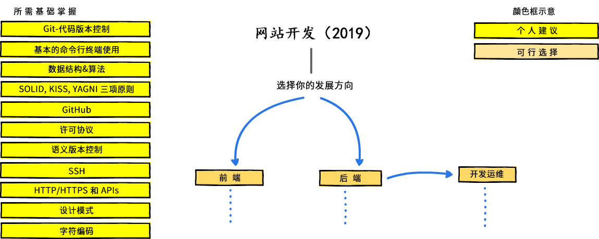
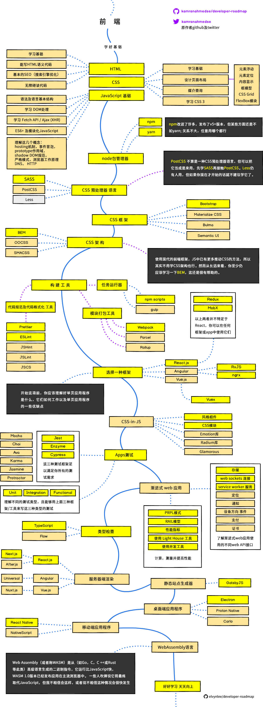
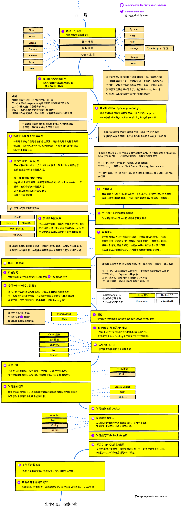

  
  <h2 align="center">开发人员路线图</h2>
  
2019网站开发人员学习路线图

  

    
    
  

   

### 前言
> 翻译了一下网站开发人员路线图，帮助清理思路。该译成中文的都尽量翻译了，没翻的基本上是大众术语或语言/工具名，个别词汇实在没有好的中文对应意思也没有译。翻译过程中不断地搜索，查阅，核对，接触许多大概的知识点，同时感叹，真是学得越多，未知越多。
 
原作者：“下面是一组图表，展示了要成为网站开发人员前端，后端或开发运维你可以走的学习路线以及你需要学的相应技术。我的一位老教授想和他的学生分享一些关于全栈工程师方面的知识和观点，所以我为他制作了这些图表。顺便分享到github社区以帮助有需要的人。”

点击访问原作者 [博客](http://kamranahmed.info)， 也可去其 [Twitter](https://twitter.com/kamranahmedse)打招呼互动.

## 免责声明
> 原作者：“这些路线图意在让你一窥网站开发的概貌，帮你了解自己接下来需要学什么，而不是鼓励你去学目前新潮的内容。你应该从中形成自己的理解，知道为什么某个开发工具在某些环境下会优于其他工具，记住时髦新潮不代表它就适合完成工作。”

## 简介

## 前端路线图

## 后端路线图

## 开发运维路线图

##下面的内容不翻啦。

## 🚦 Wrap Up

If you think any of the roadmaps can be improved, please do open a PR with any updates and submit any issues. Also, I will continue to improve this, so you might want to watch/star this repository to revisit.

## 🙌 Contribution

> Have a look at [contribution docs](./contributing.md) for how to update any of the roadmaps

- Open pull request with improvements
- Discuss ideas in issues
- Spread the word
- Reach out with any feedback 

## Sponsored By	

 - [**Hackr.io** - Best Online Programming Courses & Tutorials Recommended by the Programming Community](https://hackr.io)
 - [**Noon** – Develop, Document, Test and Monitor your APIs](https://noon.sh/)
 
## License

